# ⚖️ The Decision Guide: Multi-Agent Consensus Engine


**The Decision Guide** is an intelligent orchestration system designed to cure "decision paralysis." Built using the **Google Agent Development Kit (ADK)** and powered by **Gemini 2.5**, it simulates a consultation board by pitting an eternal **Optimist** against a hardened **Skeptic**, while a **Moderator** synthesizes the debate into a clear, unbiased trade-off analysis.

---

## 🧠 The Problem
In the age of information overload, making a simple decision (e.g., *"Should I buy this car?"* or *"Should I move to this city?"*) is difficult.
1.  **Confirmation Bias:** We tend to search only for what validates our feelings.
2.  **Review Fatigue:** Sifting through hundreds of conflicting reviews takes hours.
3.  **Generic AI:** Standard chatbots often give "safe," neutral answers that lack depth.

## 💡 The Solution
This project utilizes a **Hierarchical Multi-Agent Architecture**. Instead of one AI trying to be everything, the workload is split among three specialized agents, each with a distinct personality and strict protocol.

### 1. The Optimist Agent ("The Enthusiast") 🟢
*   **Goal:** Find the "Wins."
*   **Tools:** Uses `google_search` to find rave reviews, unique features, and quality-of-life upgrades.
*   **Personality:** Focuses on happiness, utility, and best-case scenarios. Ignores costs.

### 2. The Skeptic Agent ("The Realist") 🔵
*   **Goal:** Find the "Pain Points."
*   **Tools:** Uses `google_search` to find 1-star reviews, hidden fees, maintenance nightmares, and recalls.
*   **Personality:** Stern, warning, and immune to the "cool factor."

### 3. The Moderator Agent (Root Orchestrator) 🟣
*   **Goal:** Synthesis and Guidance.
*   **Tools:** `AgentTool` (to call sub-agents), `load_memory` (to recall context).
*   **Logic:**
    *   Analyzes the user's intent.
    *   Dispatches tasks to the Optimist and Skeptic simultaneously.
    *   Synthesizes the conflicting data into a **"Trade-Off Matrix."**
    *   Handles follow-up questions using conversation history.

---

## 🛠️ Tech Stack

*   **Language:** Python
*   **Framework:** [Google Agent Development Kit (ADK)](https://github.com/google/google-adk)
*   **LLM:** Google Gemini 2.5 Flash Lite
*   **Search Engine:** Google Search Tool (ADK native)
*   **Orchestration:** ADK `Runner` & `InMemorySessionService`

---

## 🚀 Installation & Setup

### Prerequisites
*   Python 3.9+
*   A Google Cloud Project with the Gemini API enabled.
*   A Google Search API Key (if required by your specific ADK configuration).

### 1. Clone the Repository
```bash
git clone https://github.com/bate-kamorou/kaggel_capstone_project.git
cd ./app
```

### 2. Create a Virtual Environment
```bash
python -m venv venv
source venv/bin/activate  # On Windows: venv\Scripts\activate
```

### 3. Install Dependencies
```bash
pip install google-adk google-genai
```

### 4. Environment Variables
Ensure your API keys are set. Depending on your OS, export them:

```bash
export GOOGLE_API_KEY="your_gemini_api_key"
```

---

## 💻 Usage

To run the agent locally via the terminal:

```bash
python agent.py
```

### How to Interact
The `agent.py` script includes a helper function `run_session`. You can modify the `user_queries` list at the bottom of the file to test different scenarios.

**Example 1: The Decision**
> **User:** "Should I buy a used Land Rover?"
>
> **Agent:** *Routes to Optimist (Luxury, off-road capability) and Skeptic (Reliability issues, repair costs).*
>
> **Output:** "The Trade-Off: You are trading status and comfort for high likelihood of mechanical failure."

**Example 2: The Follow-Up (Memory)**
> **User:** "Is the repair cost really that bad?"
>
> **Agent:** *Recognizes follow-up. Routes specifically to Skeptic.*
>
> **Output:** "Yes. Data shows air suspension repairs average $2,000..."

---

## 🏗️ Architecture Workflow

```mermaid
graph TD
    User[User Input] --> Moderator[🟣 Moderator Agent]
    
    subgraph "Context Check"
    Moderator -- "recall" --> Memory[(Memory Service)]
    Memory[(Memory Service)] --> Moderator
    end

    Moderator -- "Wants Benefits" --> Optimist[🟢 Optimist Agent]
    Moderator -- "Wants Risks" --> Skeptic[🔵 Skeptic Agent]
    
    Optimist -- "Finds Wins" --> G1[🔎 Google Search]
    Skeptic -- "Finds Flaws" --> G2[🔎 Google Search]
    
    G1 --> Optimist
    G2 --> Skeptic
    
    Optimist --> Moderator
    Skeptic --> Moderator
    
    Moderator --> Output[📝 Trade-Off Matrix]
```



---

## ⚙️ Configuration

You can tweak the agent behaviors in `agent.py`:

*   **Retry Logic:** Modify `retry_config` to change how the agent handles API rate limits.
    ```python
    retry_config=types.HttpRetryOptions(attempts=5, exp_base=7, ...)
    ```
*   **Model Selection:** Change `gemini-2.5-flash-lite` to `gemini-3-pro` for more complex reasoning (though more expensive).

---

## 🗺️ Roadmap

- [x] Implement Core Agents (Optimist, Skeptic, Moderator).
- [x] Integrate Google Search Tool.
- [x] Implement InMemory Session & Memory management.
- [ ] **Persistence:** Switch from `InMemorySessionService` to `DatabaseSessionService` (PostgreSQL/SQLite) for long-term history.
- [ ] **Frontend:** Build a Streamlit or Chainlit UI for a web-based experience.
- [ ] **Comparison Mode:** Enhance logic to handle "Product A vs Product B" specific table generation.

---

## 🤝 Contributing

Contributions are welcome! Please follow these steps:
1.  Fork the project.
2.  Create your feature branch (`git checkout -b feature/AmazingFeature`).
3.  Commit your changes (`git commit -m 'Add some AmazingFeature'`).
4.  Push to the branch (`git push origin feature/AmazingFeature`).
5.  Open a Pull Request.

---

## 📄 License

```
